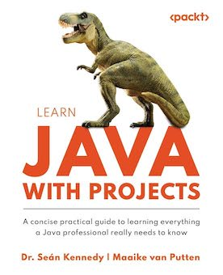

# 🧵 Concurrent Java

This project contains implementations for the concurrency exercises from *Learn Java With Projects* by Dr. Sean Kennedy & Maaike Van Putten. These exercises are designed to strengthen our understanding of Java’s concurrency and multithreading features, helping us build efficient, high-performance applications.

## 🔑 Key Concepts Covered

- **Thread Creation**: Creating and managing threads using Java's `Thread` class and `Runnable` interface.
- **Synchronization**: Using synchronized blocks and methods to avoid race conditions.
- **Thread Safety**: Ensuring safe access to shared resources with thread-safe collections and atomic operations.
- **Executor Services**: Leveraging the `ExecutorService` to manage thread pools and handle concurrent tasks.
- **Future and Callable**: Implementing `Future` and `Callable` to handle asynchronous tasks with results.

---

### Click [here](https://www.amazon.com/Learn-Java-Projects-everything-professional/dp/1837637180/ref=sr_1_1?crid=3H4JZKY6GSSX5&dib=eyJ2IjoiMSJ9.NrwQgmtjgVJXroYFKOuEKjmk4Q-KoFCM1dDGN9_AWQlhCwpPVDSJfS1fK8rxlxfq0ZzEBMAle1QFyERxjULdWdAuIqqvm4HafGtNNmQBcN9dDwRmOg5MxnsgOyZZeLw4EJhFvCnTp_ih1aEr6U6tQhYcGYK0B3QkxeUvt2Y5pFTmdQq6JtXOTf8H-QzEcXsdWDX4KbdakHj3R1WcXD2CS39iEv37bQRChWt7vYnqw3k.GQTRcup1lc4OJj7VvU19rU4nHU7NjBnWqEbgpTasmGs&dib_tag=se&keywords=learning+java+with+projects&qid=1728703615&sprefix=learning+java+with+projects%2Caps%2C158&sr=8-1) for Amazon Link:

 

